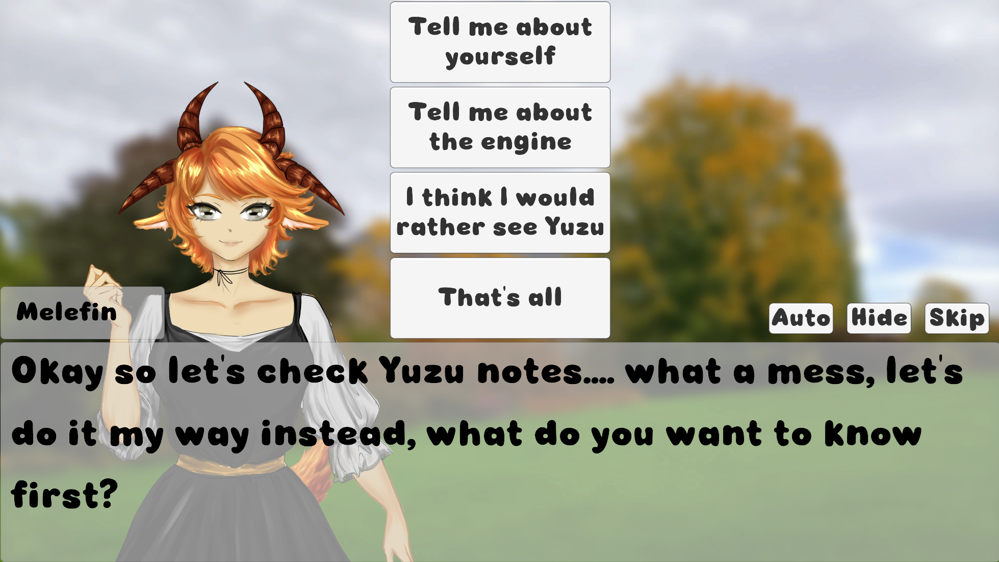
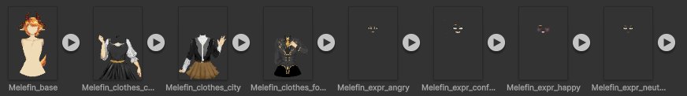
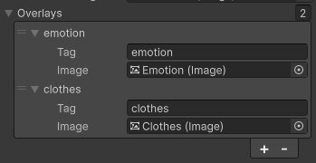
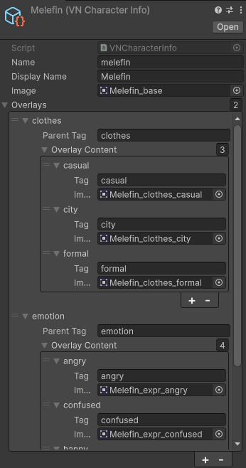

Visual novel engine working with Ink

Show dialogs workflows within your game and let the text scale properly with its container

## How to use

### Displaying text alone
To display a text character by character, you can attach the `TextDisplay.cs` component to an object containing a `TMP_TextMeshPro`

You can then show it by code
```cs
TextDisplay text; // The component we just added

text.ToDisplay = "Thanks for using Sketch.VisualNovel!"
```
Please note that the text truncate itself to fit the container so make sure there is enough space!

### Using the visual novel engine
To start with, attach the `VNManager.cs` script to an object

Our only required parameter is `Display`, which is an object containing the `TMP_TextMeshPro` and `TextDisplay` components \
This object is the one that will show our text character by character as explained in the section above

From that you can just set your `PlayerInput` to call `OnNextDialogue` and call the engine from script:
```cs
TextAsset compiledStoryFile;
VNManager.Instance.ShowStory(compiledStoryFile);
```

### Ink tags
Some of the [Ink tags](https://github.com/inkle/ink/blob/master/Documentation/WritingWithInk.md#tags) will be interpreted by the engine:
- **#speaker name/none**: Look for the corresponding character and how its name and image, if the characters attribute is empty, will use the parameter given as text
- **#skip true/false**: Toggle skip option manually
- **#background name/none**: Show an image on the background

### VNManager attributes
All the following attributes are optional
- **Characters**: A list of `VNCharacterInfo`, these allow you to use the speaker tag as mentionned above
- **Overlays**: Allow to display images with tags, see section below
- **Background Image**: Image containing the background
- **Backgrounds**: Associate tags with background images
- **Container**: Object surrounding your text, is automatically shown or hide depending of the state of the VN
- **Name Panel**: Container surrounding the name text, only shown when a name is shown
- **Name Text**: Show the name of a character, used with the speaker tag as mentionned above
- **Character Image**: Show a character sprite, used with the speaker tag as mentionned above
- **Choice Container**: Gameobject that contain choice prefabs, choices as written as per [Ink documentation](https://github.com/inkle/ink/blob/master/Documentation/WritingWithInk.md#2-choices)
- **Choice Prefab**: Button that will be spawned inside the choice container (Also need to contain TMP_TextMeshPro as a child of the button)

For example on this example:
- **Characters**: File for the character "Melefin", speaker set from Ink using #speaker melefin
- **Background Image**: Image showing the grassy area with tree in the background
- **Container**: Object containing the bottom part of the visual novel (panel containing name and visual novel text)
- **Name panel**: Panel around the name "Melefin"
- **Name Text**: TMP_Text object containing the text "Melefin"
- **Character Image**: Sprite showing the anthropomorphized sheep Melefin
- **Choice Container**: Game object containing all the choices buttons
- **Choice Prefab**: Prefab of a single button


### Public methods
- **ToggleSkip / OnSkip**: Skip is a feature that will very quickly go through dialogues, it'll automatically stop at the first choice shown
- **ToggleHide / OnHide**: Hide the interface and the character sprite, this is generally used if you want the character to enjoy a background or CG that is shown on screen
- **OnAuto**: Auto is a feature that will slowly go through dialogues so the player don't have to click manually, it'll automatically stop at the first choice shown
- **DisplayNextDialogue**: Manually toggle the next dialogue, if called while the text is being displayed, it'll instead instantly display it

### Overlays
Overlays are a way to easily set sprites within Ink

For example in the screenshot above the base sprite of Melefin is separated between the base body, clothes and visual expressions
 \
We can then create images that will overlaps your base Melefin body and assign them a tag in our VNManager \
 \
We then add which sprite corresponds to what tag in our scriptable object \
 \
We can see that here in our VNManager the tag "clothes" is associated to the Image named "Clothes" \
Likewise in our scriptable objects, we created a tag with parent tag "clothes" (must match the VNManager one and inside defined all our clothes associated to a tag)

We can then use the syntax `#parentTag tag` within Ink \
For example `#clothes formal` will show Melefin formal attire

### Example
An example of using tags with Ink is available at https://github.com/Xwilarg/Sketch/blob/master/Assets/Stories/Story.ink